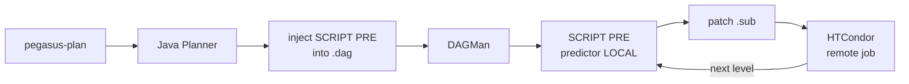

# Pegasus Runtime Prediction: Project Report

---

## 1. What Have You Built?

### One Paragraph Description

A runtime prediction system that automatically predicts how long each job will take before it is submitted to the cluster, using a pre-trained VAE/Oracle model built on real workflow execution traces collected via Pegasus ACCESS. It integrates natively into Pegasus WMS as a pre-execution hook running locally on the submit host before each job, with no changes to the user's workflow file, no new services, and no extra infrastructure. The user installs once and continues using Pegasus exactly as before.

### Screenshot / Demo

```
$ pegasus-plan workflow.yml --sites condorpool --output-sites local -v
...
[pegasus-plan] Injecting runtime prediction prescripts into submit/hamza/pegasus/diamond/run0006
[pegasus-inject-prescripts] DAG:       .../diamond-0.dag
[pegasus-inject-prescripts] Workflow:  .../workflow.yml
[pegasus-inject-prescripts] Output:    .../output
[pegasus-inject-prescripts] Predictor: .../pegasus-runtime-predictor
[pegasus-inject-prescripts] Done: 4 SCRIPT PRE lines injected, 11 system jobs skipped.
```

### Link to Code

https://github.com/swarmourr/pegasus-wms-runtime/tree/integration

### Current Status

**Working Prototype.** Runs end-to-end on a real Pegasus diamond workflow. Planning, injection, prediction, and `.sub` patching all work. Handles parallel jobs at the same DAG level correctly via atomic JSON write.

---

## 2. How Would a Pegasus User Use It?

### Example User Story

A researcher submits a 500-job genomics workflow. Without runtime prediction, every job is sent to the cluster with the same generic resource request. HTCondor has no idea which jobs take 5 minutes and which take 5 hours. The result: short jobs waste large slots, long jobs get evicted for exceeding their walltime, and the researcher only finds out something went wrong after hours of waiting.

With this system installed, the workflow runs exactly the same way, but before each job is submitted, the predictor automatically estimates its runtime based on the actual sizes of input files produced by the previous level. Each prediction comes with an approximate time range: for example, job 42 is expected to take approximately 47 minutes, with a confidence interval between 39 and 55 minutes. The scheduler uses this range to assign an appropriate slot. Job 107 has an unusually high anomaly score, meaning it is running under conditions the model has not seen before (unusual input size, atypical data, unfamiliar pattern). The job may still complete successfully, but its runtime will likely fall outside the predicted range.

**What the researcher gains:**
- Jobs get approximative walltimes, fewer evictions, better slot usage
- Jobs with unusual conditions are flagged before they run, giving the researcher early visibility
- Predictions improve level by level as real file sizes become available
- The researcher can set up a notification (email or Slack) triggered automatically before each job starts, including the predicted runtime, the confidence interval, and the anomaly score, so they have a clear picture of what to expect before the job even reaches the cluster
- Nothing changes in their workflow or commands

### What Problem Does It Solve?

| Problem | Impact | Solution |
|---|---|---|
| Jobs are submitted with no runtime estimate | Slots are over-requested or under-requested, wasting cluster resources or causing evictions | Provides an approximative walltime with confidence interval before each job is submitted |
| The scheduler treats all jobs equally regardless of expected duration | Short jobs wait in large slots, long jobs get killed | Predicted runtime is embedded directly in the job so the scheduler can make better matching decisions |
| No way to detect jobs that will behave unexpectedly before they run | Issues are discovered after hours of wasted compute time | Anomaly score flags jobs with atypical input conditions before they reach the cluster |
| Predictions at the start of a workflow rely on static file sizes | First-level predictions are less accurate | From level 1 onwards, predictions use real output sizes from completed jobs, improving accuracy progressively |
| Researchers have no visibility into upcoming job behavior | No time to react before a problematic job runs | Notifications deliver predicted runtime, confidence interval, and anomaly score before each job starts |
| External systems such as schedulers, dashboards, and resource managers have no access to runtime predictions | Each system has to implement its own estimation logic independently | The prediction engine can be exposed as a REST API, allowing any external system to query job runtime predictions without being integrated into Pegasus |

---

## 3. How Does It Connect to Pegasus?

### Existing Integration Point

No new integration was needed. `SCRIPT PRE` is a standard DAGMan feature built into every Pegasus installation. It runs a local command on the submit host before each job is submitted to HTCondor. The only file modified in the original Pegasus package is `bin/pegasus-plan`, with 15 lines added at the end of the existing shell script to call `pegasus-inject-prescripts` after planning succeeds. Everything else is additive.

The user runs `pegasus-plan` as usual, which calls the Java Planner to generate the workflow DAG and all job submit files. Once planning completes, `pegasus-inject-prescripts` automatically post-processes the DAG: it reads the `.dag` file, computes the topological levels of all jobs from the PARENT/CHILD relationships, skips Pegasus system jobs (stage-in, stage-out, cleanup), and injects a prediction hook before each user job. DAGMan then takes over and manages execution level by level. Before each job is submitted, `pegasus-runtime-predictor` runs locally on the submit host, reads the workflow definition and the real file sizes of outputs from already completed jobs, runs the ML model, and patches the job's submit file with the predicted runtime. For parallel jobs at the same level, only the first caller runs the model and all others wait and read from the shared result. The job is then sent to the remote cluster with the prediction already embedded. When that job completes, its output file sizes become available for the next level's predictions, improving accuracy as the workflow progresses. Everything runs as local processes on the submit host with no daemon, no server, and no network calls.

### REST API Integration (Possible Extension)

The prediction engine can also be exposed as a REST API, allowing external systems to query job runtime predictions independently of Pegasus. Any scheduler, monitoring dashboard, or resource manager could send a job description and receive a predicted runtime, confidence interval, and anomaly score in response.

```
POST /predict
{
  "transformation": "diamond::findrange",
  "input_file_size": 3847291,
  "num_inputs": 2,
  "num_outputs": 2,
  "dag_level": 1
}

Response:
{
  "predicted_runtime_s": 47.3,
  "lower_bound_s": 39.1,
  "upper_bound_s": 55.6,
  "anomaly_score": 0.12,
  "status": "NORMAL"
}
```

This integration is not yet implemented but is a natural extension of the existing prediction module, which already runs as a standalone CLI tool.

### Architecture Diagram




---

## 4. What Would It Take to Make It Production-Ready?

## For HTCondor environments, the system is already production-ready. It runs end-to-end on a real Pegasus workflow with no manual steps after installation. The remaining step before claiming full production readiness is validation on more complex workflows such as Montage, Epigenomics, and CyberShake.

The items below are extensions needed for broader adoption beyond HTCondor.

### What Is Missing for Broader Adoption?

| Area | Description |
|---|---|
| **Resource manager support** | The current implementation patches HTCondor `.sub` files only. Most production clusters run SLURM or PBS. Extending patching to those schedulers is the main step needed to move beyond HTCondor environments. |
| **Broader workflow coverage** | The model was trained on a specific set of workflow traces. Validating and tuning predictions on larger, more diverse workflows such as Montage, Epigenomics, and CyberShake will improve accuracy across domains over time. |
| Model versioning | Allow teams to maintain and switch between model versions depending on their workflow domain. |
| Confidence filtering | Skip runtime patching when the model confidence is low, letting the scheduler use its own defaults. |

### Biggest Technical Challenges

1. **Parallel job prediction at scale.** When hundreds of jobs are ready at the same DAG level, all of them trigger the predictor simultaneously on the submit host. The current solution uses an atomic file write so only the first caller runs the model and all others wait and read the result, avoiding redundant computation and race conditions.

2. **Prediction accuracy at the first level.** The first level of a workflow has no predecessor jobs, so predictions rely on static file sizes from the workflow definition rather than real measured values. Accuracy improves from level 1 onwards as real file sizes become available.

3. **Model coverage across domains.** The model was trained on Pegasus ACCESS workflow traces. Workflows from domains or institutions not represented in that dataset may produce less accurate predictions until the model is exposed to similar execution data.

### Rough Effort Estimate

| Scope | Estimate |
|---|---|
| Current working prototype | Done |
| Confidence filtering and model versioning | Small |
| Broader workflow validation | Small |
| Resource manager support (SLURM, PBS) | Medium |
